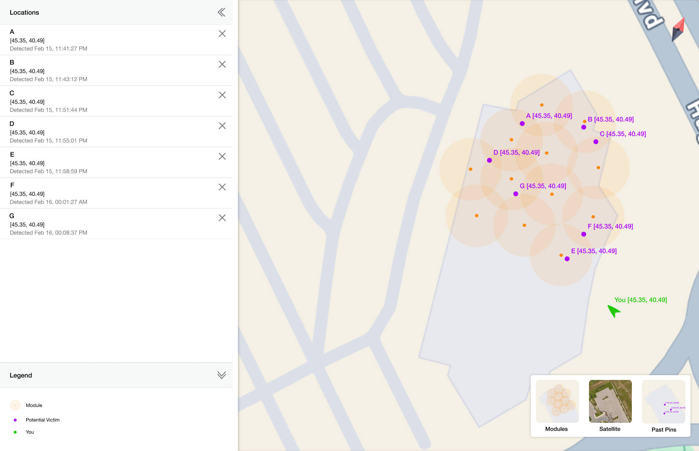
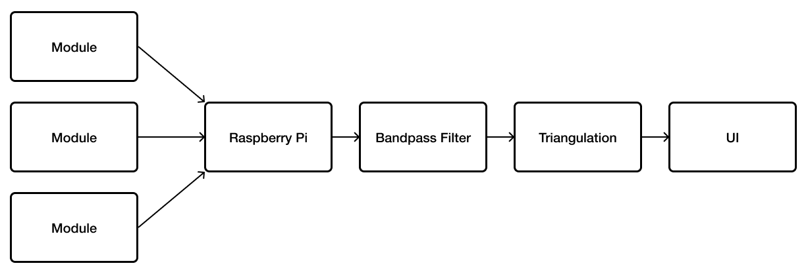
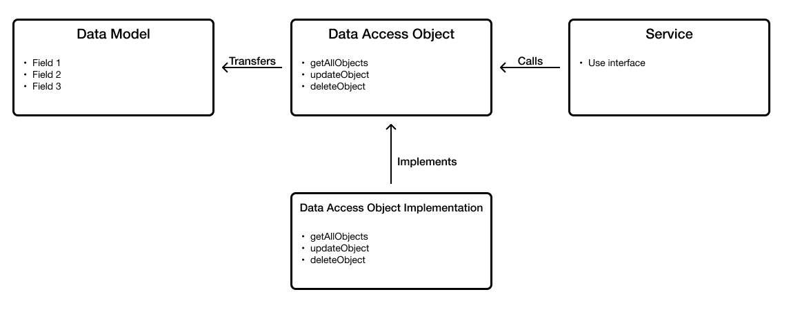
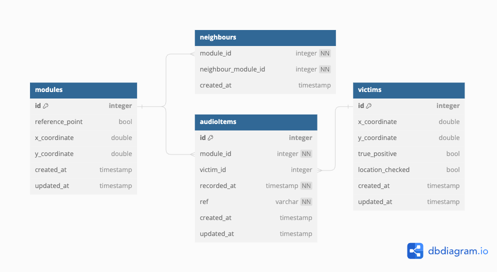

# Rubble Rescue Application
This is the application portion of the Rubble Rescue project. The application will integrate three of the project's submodules: the modules, the bandpass filter, and triangulation. The application will produce potential locations of victims and display them in a graphical user interface. Below is an early iteration of the map interface that will be displayed to users.

<p align="center">
  
</p>

## Implementation

### Data Flow

Data will come from the modules, pass through the bandpass filter, then be used for triangulation. It will then be displayed to the user.

<p align="center">
  
</p>


### Technologies

- PyQt (Application framework)
- SciPy (Library used for bandpass filter)
- ReactiveX (Used for events and multithreading)
- SQLite3

### Application Structure
The application has three main services: the modules, the bandpass filter, and the triangulation. Files have a service-based organization, where each service is contained within its own directory:

```
app/
│
├── modules/
│   ├── __init__.py
│   └── producer.py
│
├── filter/
│   ├── __init__.py
│   └── subject.py
│
├── triangulation/
│   ├── __init__.py
│   └── subject.py
│
└── main.py
```

This structure makes the code easy to understand and makes it easier to add other services in the future. This is beneficial as we may want to add a machine learning service in a future iteration.

The application also follows the Data Access Object (DAO) pattern. This pattern is used to separate the data persistence logic in a separate layer. This way, services have no knowledge of how the low-level operations to access the database are done.

<p align="center">
  
</p>

The data models are contained in the `models/` directory, the DAOs are contained in the `dao/` directory.

### Database
A relational database is used to store data about the modules, potential victims, and metadata for the audio files collected from the modules. The audio files themselves will be stored using local file storage. Below is the first iteration of the database schema:

<p align="center">
  
</p>

[dbdiagram.io](https://dbdiagram.io/d/Rubble-Rescue-65dc0f005cd0412774c92799)

Files for database migration, and database connection are in the `dao/db/` directory.

#### Transaction Handler
Transactions and transaction handlers are crucial for managing data integrity and consistency, especially when dealing with RDBs.

1. Atomic operations
    1. DAO pattern often involves multiple db operations (e.g., inserting data into multiple tables, updating related records) to complete a simple logical task. One example for our project being that if a new AudioItem is added, the coordinates of the related Victim may need to be updated
    2. Transactions ensure that these operations are atomic, meaning they are either all succeed or all fail. This is essential for maintaining data consistency and integrity.
2. Isolation and consistency
    1. Transactions provide isolation and consistency guarantees. They ensure that db operations do not interfere with each other and that the db remains in a consistent state at all times
    2. DAO implementations typically encapsulate transaction logic to ensure that data operations are performed within transaction boundaries
3. Abstraction
    1. Transaction handlers in the DAO pattern are responsible for managing the lifecycle of transactions, including starting, committing, or rolling back transactions based on the success or failure of the db operations
    2. DAO implementations often incorporate transaction handlers to abstract away transaction management details from the service layer
4. Exception Handling
    1. Transaction handlers handle exceptions that may occur during db operations. If an exception occurs, the transaction is rolled back to ensure that no partial changes are committed to the db