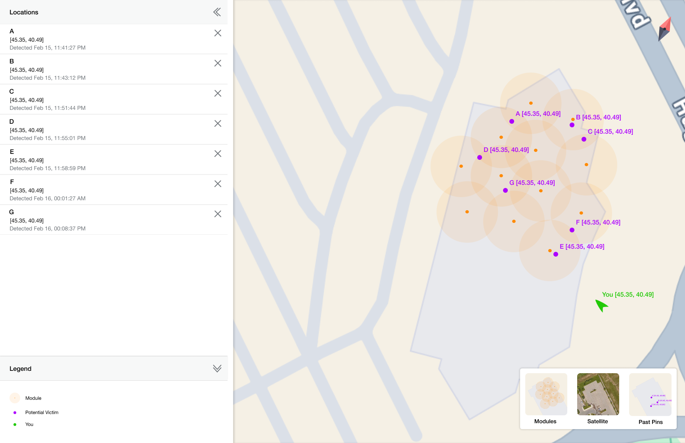

# Interface
We will (try to) use the Model-View-Controller (MVC) design pattern.

  

Below is an early iteration of the map interface that will be displayed to users.

  

The left side of the interface shows a list of the locations of potential victims. Each item in the list is associated with a purple pin on the map. Below the list of pins is a legend for the map. The right side of the interface is a map of the rubble region where the modules are dispersed. The map also shows the user's current location.